Проходження інтерактивного курсу git-how-to

### Screenshot 1
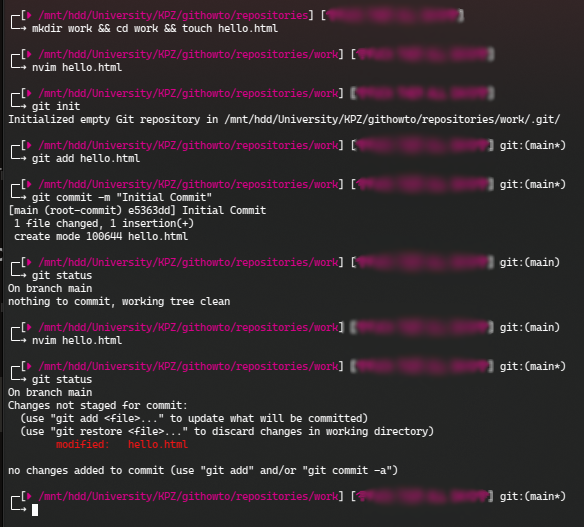
Після створення директорії work та файлу в неї hello.html, додав до файлу "Hello, World", та ініціалізував репозіторій git завдяки команди "git init".
Додав файл hello.html до репозиторію, та зробив перший комміт.
Перевірив стан репозиторія, зробив зміни до hello.html та перевірив знову стан, щоб підтвердити, що зміни відбулися.

### Screenshot 2
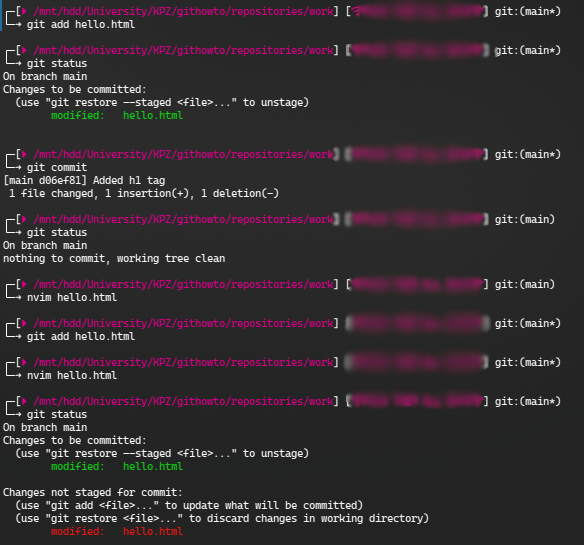
Проіндексував зміни hello.html та перевірив стан репозиторія.
Закомитив усі зміни та перевірив стан.
змінив дані файлу hello.html та проіндексував зміни, змінив файл знову та перевірив стан репозиторія 

### Screenshot 3
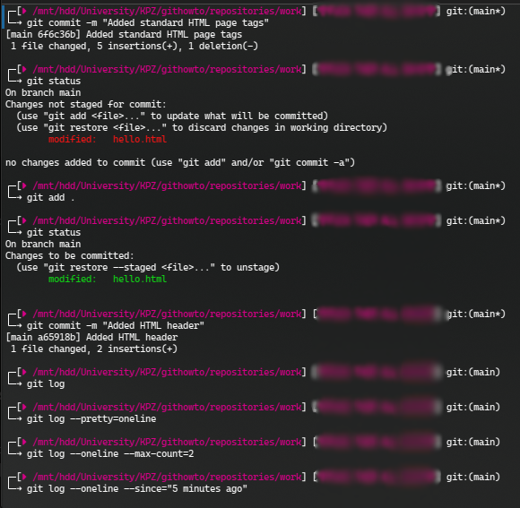
Зробив комміт та перевірив стан, можна побачити, що зміни після індексації не були додані, додамо їх.
Перевіряємо статус, бачимо, що зміни були та робимо комміт.
Перевіряю логи, які відкриваються у окремому вім окні.
### Screenshot 4
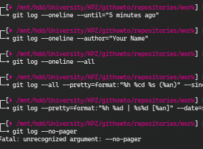
### Screenshot 5
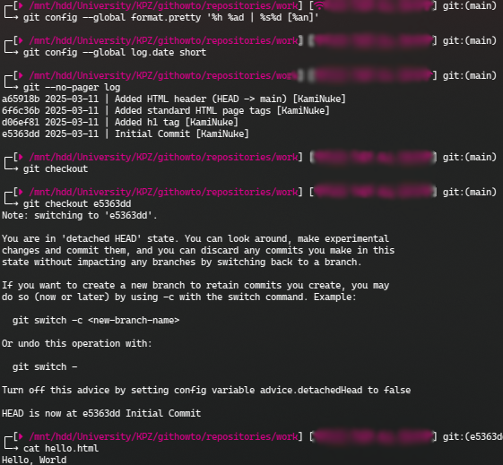
Додав форматировку виведення інформації та за допомогою аргумента --no-pager виводжу логі відразу у консоль а не відкриваю файл лога.
Повернуся до першого комміту та перевірив, що зміст файлу дійсно як у першого комміта

### Screenshot 6
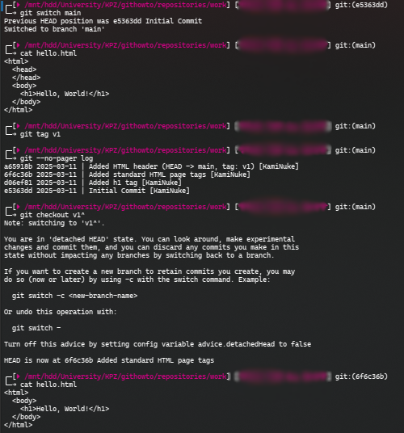
Змінив комміт на останній, перевірив, що дійсно змінилося.
Створив тег поточній версії та подивився логи.
Повернувся на комміт попередній за v1 за допомогою git checkout v1^ та перевірив, що зміни відбулися

### Screenshot 7
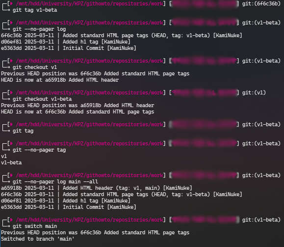
додав тег v1-beta та подивився логі, щоб впевнитися у тегу.
Змінив комміт на v1 та після на v1-beta.
Завдяки команді git tag можна побачити усі теги
Змінив на останній комміт.

### Screenshot 8
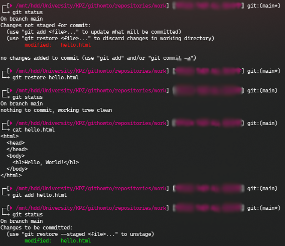
Змінив зміст файлу .html та перевірив статус репозиторія.
Відновив зміст файлу завдяки git restore <файл>
перевірив статус та зміст файлу, 

### Screenshot 9
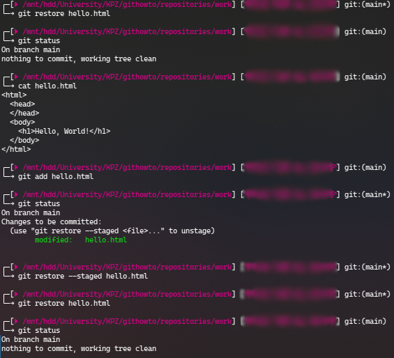
Очистив область показу завядяки аргументу --staged, але в фактичному каталозі змін не буде
Відновив файл до останього комміту.

### Screenshot 10
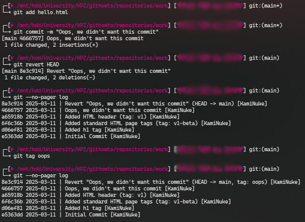
Змінив зміст файлу .html, додав комміт.
Зробив комміт, що видаляє зміни (git revert HEAD) та перевірив логи
Додав тег oops та перевірив логи

### Screenshot 11
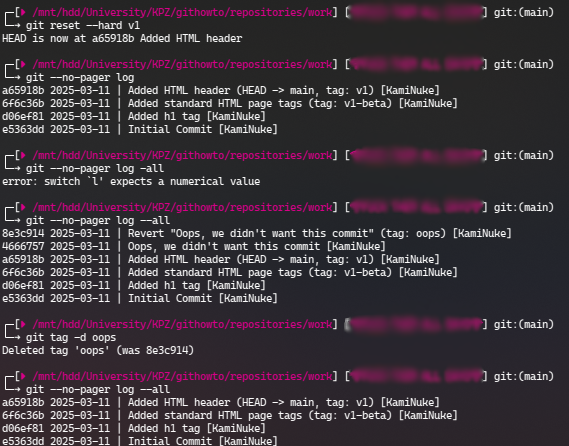
Скидую гилку до тегу v1 та видаляю тег oops

### Screenshot 12
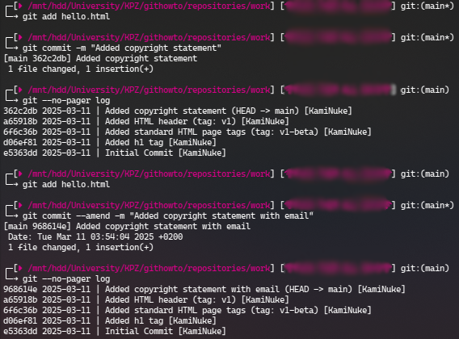
Додав зміни до файлу .html та зробив комміт
Забув додати додаткову зміну та додав .html знову.
За допомогою аргументу --amend змінив останній комміт тім, що додав в нього додаткову зміну

### Screenshot 13

Створив гілку style, перевірив статус, створив файл та додав і зробив комміт.
Змінив .html і знову додав комміт.

### Screenshot 14
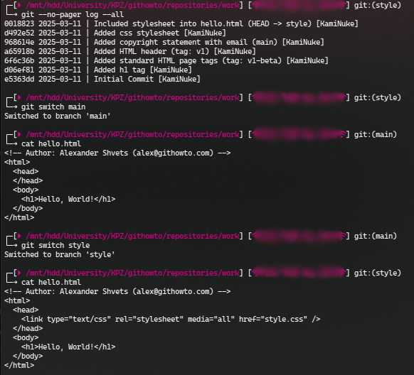
Перевірив логи, змінив гілку на main
перевірив файл, можна побачити змін немає, які зробили у style гілки.

### Screenshot 15
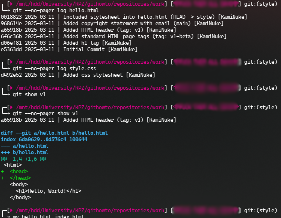
Переглянув історію файлів та файлу в комміті(тегу)
Переіменував файл hello.html на index.html

### Screenshot 16
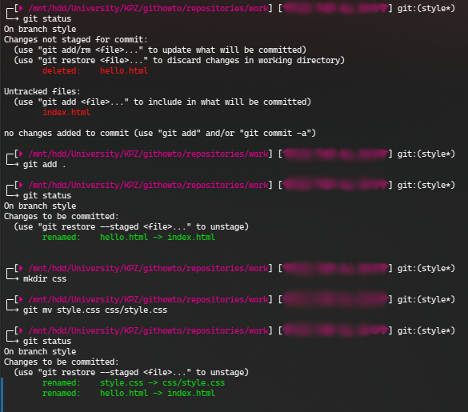
Перевірив статус та додав усі зміни та перевірив зміни знову побачивши, що вони відбулися
створив папку css та перемистив файл style.css до css/style.css та перевірив зміни, щоб побачити, що файл переместився

### Screenshot 17
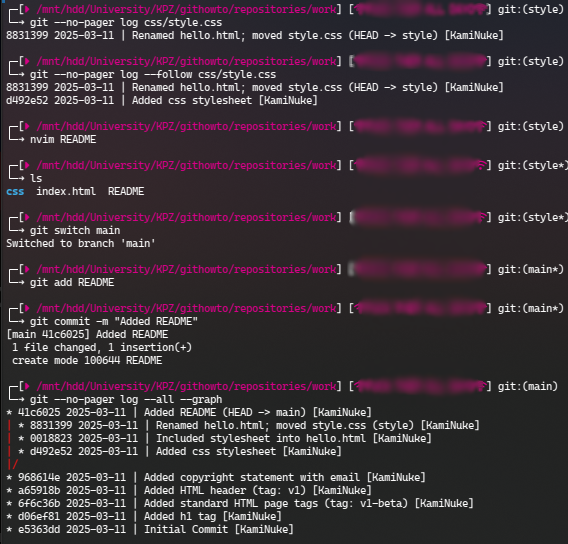
Cтворив README файл та змінив гілку на main, та попробув додати файл README до репозиторію, що успішно вдалося
-all аргумент в логах показує нам усі гілки

### Screenshot 18
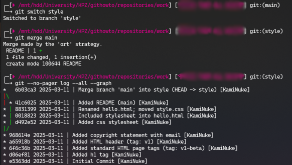
Змінив гілку на style та злив її з main, перевірив в логах та все є

### Screenshot 19
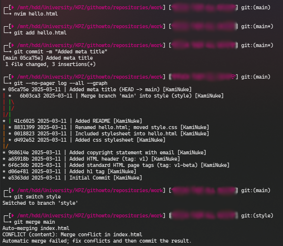
Зробимо конфлікт, змінив та додав до репо файл .html, зробив комміт, перевірив логи
Змінив гілкун а style та попробував злити з main, як і очікувалось ми получили конфлікт.

### Screenshot 20
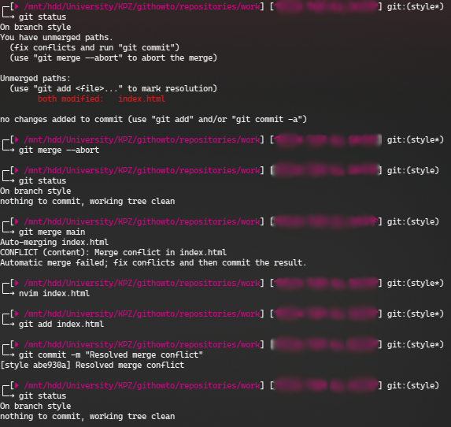
За допомогою --abort можна відминити злиття
Зробив ще раз злив, вручну виправив конфліктну частину файлу >>>>> <<<< та успішно пофіксив конфлікт, що можна побачити по комміту

### Screenshot 21
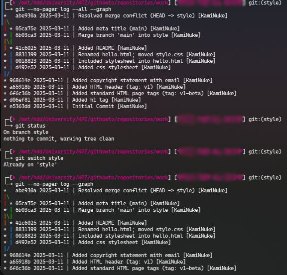
Побачимо логи, щоб переконатися, що усе гаразд

### Screenshot 22
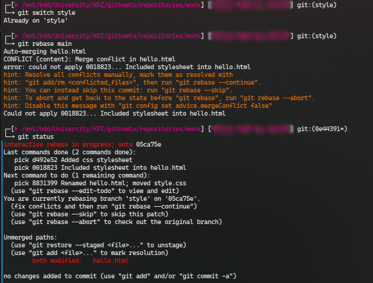
Пробую зробити зміни за допомогою rebase аніж merge, і робимо у гілці style бо тут немає коммітів з main поки що
Фіксимо конфлікт, та комміт з rebase не потрібен

### Screenshot 23
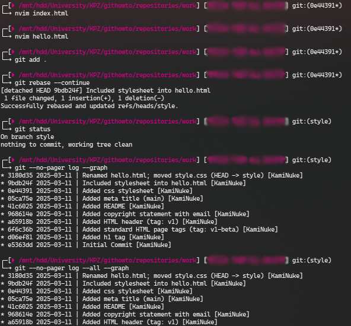
змінюю файли *.html та додаю их до репо, додаємо всі зміни з поточних директорій, перевіряємо статус та логи

### Screenshot 24
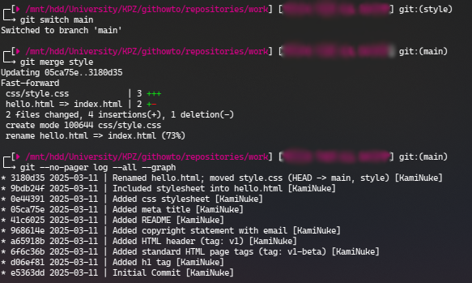
змінюємо на main, рообимо мердж з style і як бачимо усе працює

### Screenshot 25
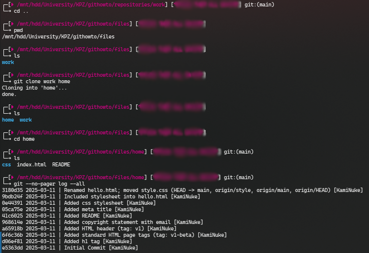
Клонирую репо у поточну директорію

### Screenshot 26
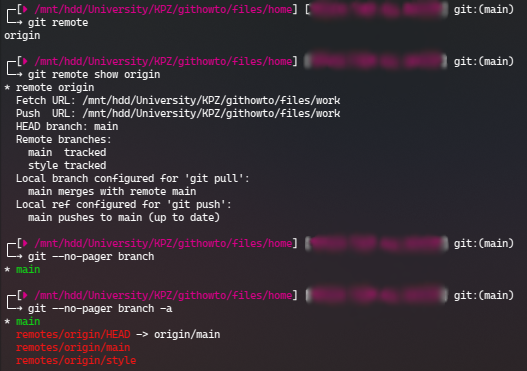
дазнаюся імена віддаленних репозиторіїв, отримаємо більш детальну інформацію, дивимося всігілки

### Screenshot 27
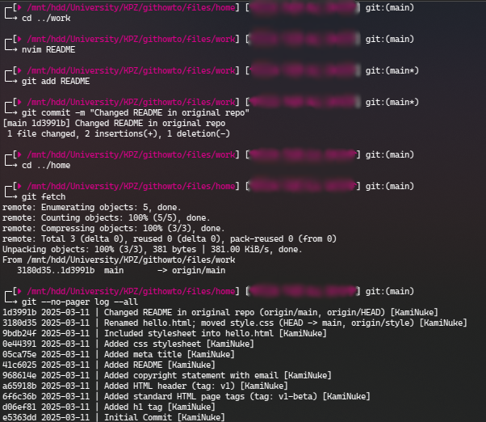
в оріг. репо зробив зміни і зробив комміт.
В удаленному репо підтянув зміни та перевірив логи, 

### Screenshot 28
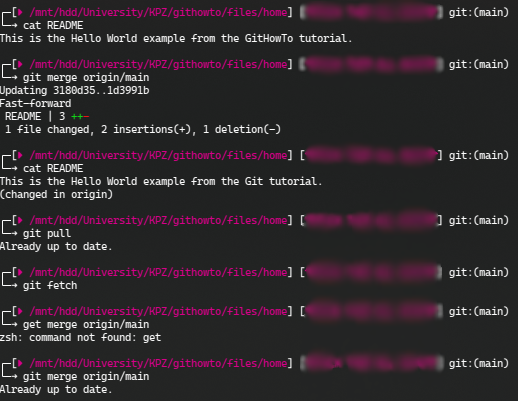
Перевірив зміни їх ще нема
Злив підтигнути зміни у локальний main, перевірив README знов, і вони тепер є
Перевіри чи є нові зміни

### Screenshot 29
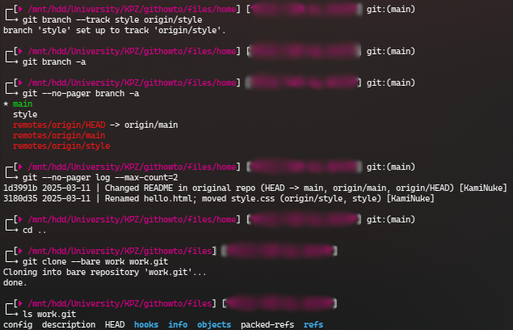
Додав локальну гілку, котра відстежує віддалену гілку 
Створив чистий репозиторій

### Screenshot 30
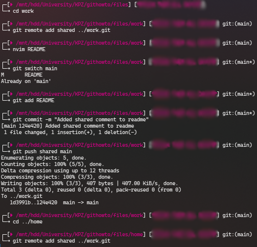
Додав репозиторій до оригінального репо.

### Screenshot 31
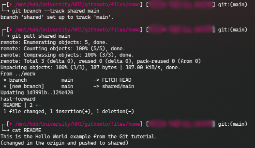
Зробив зміни в main та надіслав їх до спільного репо
Та підтянув зміни

### Screenshot 32
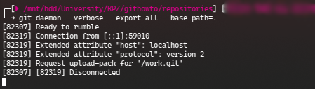
Запустив гіт сервер

### Screenshot 33
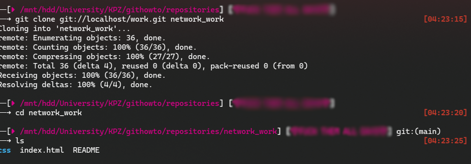
В окремому термінали зробив гіт клон проекту з локального серверу та перевірив його

