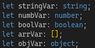

Лаболаторна робота 1

1. Типізація змінних
1.1	Оголосіть змінні наступних типів: string, number, boolean, array, object.

1.2	Створіть функцію, яка приймає як аргумент об'єкт із полями name (тип string) та age (тип number) і повертає рядок виду: "Name: John, Age: 30".

3. Інтерфейси
2.1	Оголосіть інтерфейс Person, який містить поля:
a.	name: string
b.	age: number
c.	address?: string (опціональне поле)
2.2	Реалізуйте функцію printPerson, яка приймає об'єкт типу Person та виводить його дані у консоль.

4. Композитні типи
3.1.	Оголосіть об'єднаний тип (union type)
type Status = 'success' | 'error' | 'loading';
3.2.	Реалізуйте конструкцію (наприклад, функцію або умову), яка виводить повідомлення відповідно до значення Status.

5. Дженерики
4.1.	Реалізуйте функцію identity<T>(value: T): T, яка повертає передане їй значення.
4.2.	Використайте її для типів number, string та boolean.

6. Класи
5.1.	Реалізуйте клас Car, який містить поля:
a.	model: string
b.	year: number
5.2.	Додайте метод getCarInfo(), який повертає рядок виду: "Model: Toyota, Year: 2020".
