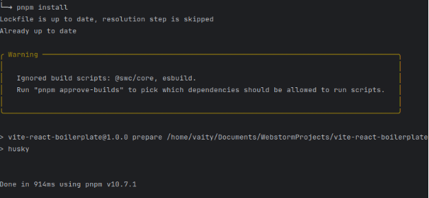
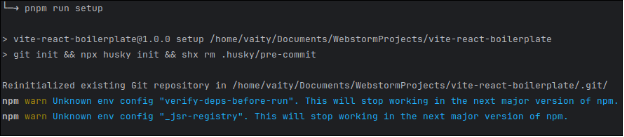
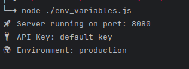
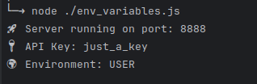

# Практичне заняття №2
### Тема: Комплексне дослідження структури, конфігурацій та робочого середовища сучасного JavaScript-проєкту на основі бойлерплейта vite-react-boilerplate

### Мета:
-	Познайомитись із структурою файлу package.json як центрального конфігураційного файлу JavaScript-проєкту, зрозуміти основні поля: імʼя, автор, опис, версія, ліцензія, репозиторій, скрипти та залежності.
-	Вивчити принципи семантичного версіонування (SemVer) через аналіз реальних залежностей.
-	Ознайомитись із практикою оформлення проєктної документації (README.md).
-	Вивчити призначення файлів .gitignore та LICENSE.
-	Розібратися з роботою гіт-хуків через аналіз артефактів, які створює бібліотека Husky.

#### Завдання
Загальні вимоги:
-	Створіть власний GitHub-репозиторій для звітності по лабораторній роботі.
-	Звіт оформіть у вигляді файлу README.md у корені вашого репозиторію, додаючи пояснення та вбудовані скріншоти.

#### Завдання 1: Початкова підготовка середовища
1.	Склонуйте репозиторій vite-react-boilerplate.
2.	Встановіть усі залежності проєкту, використовуючи команду pnpm install.

Як можно побачити, залежності були встановлені успішно, а цей варнінг можна проігнорувати.

3.	Запустіть початковий скрипт сетапу проєкту (pnpm run setup).

Після pnpm run setup, успішно встановлено, варнінги ці також можна проігнорувати.

#### Завдання 2: Аналіз структури файлу package.json
1.	Опишіть у звіті призначення полів файлу package.json: name, author, description, version, license, repository, scripts, dependencies, devDependencies.
    name – назва проекту 
    author – автор проекту 
    description – опис проекту 
    version – версія проекту
    license – ліцензія проекту
    scripts – скріпти для автоматизації завдань
    dependencies – залежності для того, щоб програма працювала в юзер середовищі
    devDependencies – залежності для розробки проекту

2.	Проаналізуйте залежності, вказані у dependencies та devDependencies, поясніть логіку такої класифікації.

 dependencies – включать бібліотеки для того, щоб програма працювала як в юзер середовищі так і в дев середовищі
Тут є компоненти UI - nivo, react.
Компоненти для управління запитами react-query, zustand
Маршрутизації - react-router, raect-query
Бібліотека для роботи з датами - dayjs
i18next - фреймворк інтерналізації та інше

 devDependencies – включать бібліотеки для того, щоб програма працювала як в дев середовищі, але не мають впливу після деплоймента проекту
vite, typescript, postcss, autoprefixeк - безпосередно необхідно для розробки
husky, commitizen - для комітів
та інші

Це необхідно для зменшення розміру версії для користувачів та абстракції проекту.

#### Завдання 3: Семантичне версіонування (SemVer)
1.	Ознайомтесь із принципами SemVer.
2.	Дослідіть версії пакетів бойлерплейту. Поясніть, які оновлення (мажорні, мінорні, патчі) допускаються відповідно до версій, зазначених у файлі package.json.

В package.json всюди оператор '^', якийдозволяє автоматичне оновлення до останніх мінорних і патч версій у межах поточної мажорної версії 

#### Завдання 4: Дослідження додаткових конфігураційних файлів
Проаналізуйте та опишіть призначення, структуру та важливі елементи файлів:

-	README.md - документаційний файл для проекту, зазвичай містить опис проекту, інструкції з встановлення, налаштування та інше
-	.gitignore – вказує git, які файли або директорії не потрібно відстежувати або включати в систему контролю версій
-	LICENSE - умови ліцензування проекту, описує ліцензію, умови використання та обмеження

#### Завдання 5: Аналіз роботи гіт-хуків Husky

1.	Дослідіть артефакти, які створюються після встановлення та налаштування бібліотеки Husky.

commit-msg - це скрипт, який перевіряє повідомлення комітів
prepare-commit-msg - хук, використовується для автоматичного формування повідомлення коміту.

2.	Опишіть, для чого потрібні ці артефакти, як вони налаштовуються та яку роль відіграють у процесі розробки.

commit-msg - перевіряє повідомлення коміту, щоб забезпечити правильний формат і структуру.
prepare-commit-msg - автоматично додає зміст до повідомлення коміту, або заповнює повідомлення відповідно до стандартів проекту.

#### Завдання 6: Використання змінних оточення
1.	Напишіть скрипт, який буде читати довільну змінну оточення та друкувати її значення у консоль.
2.	Задайте різне значення змінної оточення на різних рівнях (ОС, сесія терміналу, окремий запуск скрипта, dotEnv файл) та дослідіть пріоритетність їх застосування.
3.	Зафіксуйте отримані результати. 

До додавання змінних в .env файл

Після додавання

` 
// Load .env variables
import dotenv from 'dotenv';

// Load environment variables from .env file
dotenv.config();

// Access environment variables
const port = process.env.PORT || 8080;
const apiKey = process.env.API_KEY || 'default_key';
const environment = process.env.ENVIRONMENT || 'production';

// Output the results
console.log(`🚀 Server running on port: ${port}`);
console.log(`🔑 API Key: ${apiKey}`);
console.log(`🌍 Environment: ${environment}`);
`
