### Лабораторна робота 3

1. склонувати [repo_link](https://github.com/mkosir/typeorm-express-typescript)
2. відкрити у webstorm
3. змінити порт постгреса у docker-compose.dev.yml з 5432 на 8432

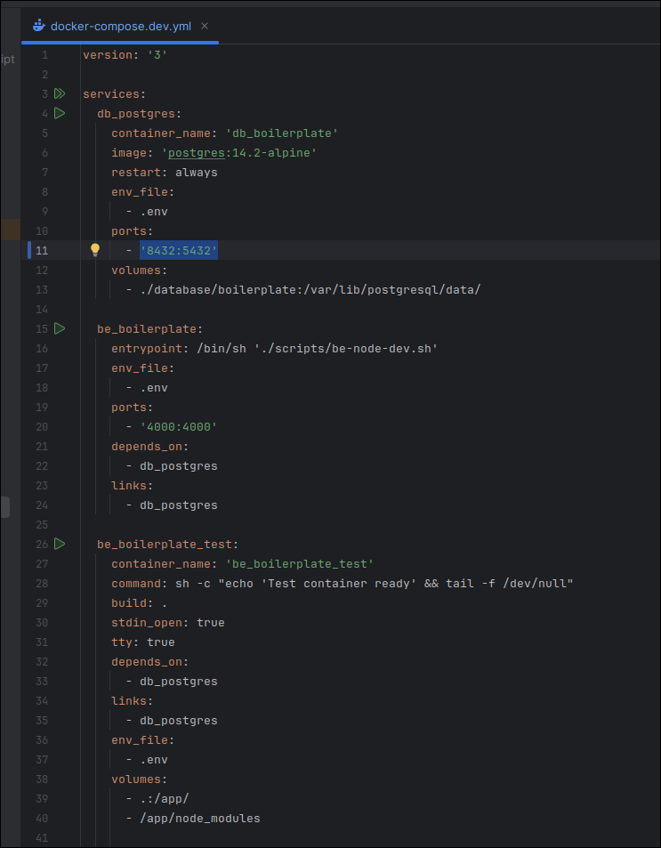

4. Запустити docker:dev в файлі package.json

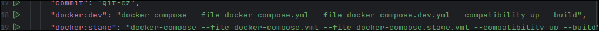

В консолі можна побачити, якщо докер працює

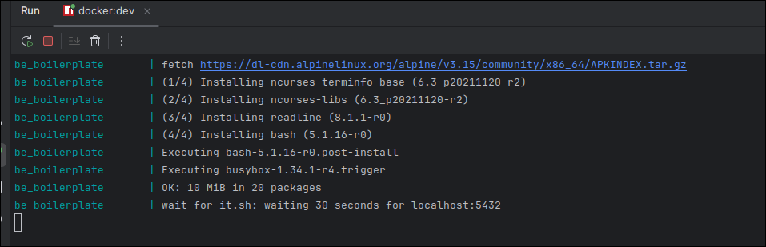

Та за допомогою команди docker ps, що докер працює

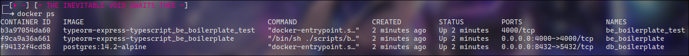

5. Додати бд до data source у webstorm та використовувати 

Беремо логін та пароль з .env файлу

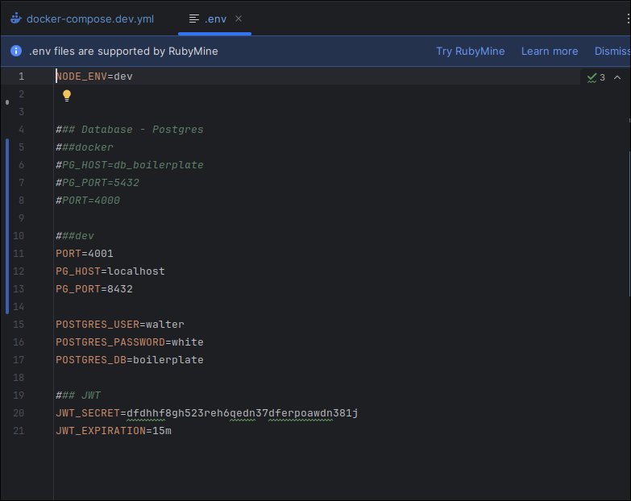

Додаємо data source у webstrorm, змінюємо порт на 8432 та пробуємо пієднатися, і як можна побачити - успіх.

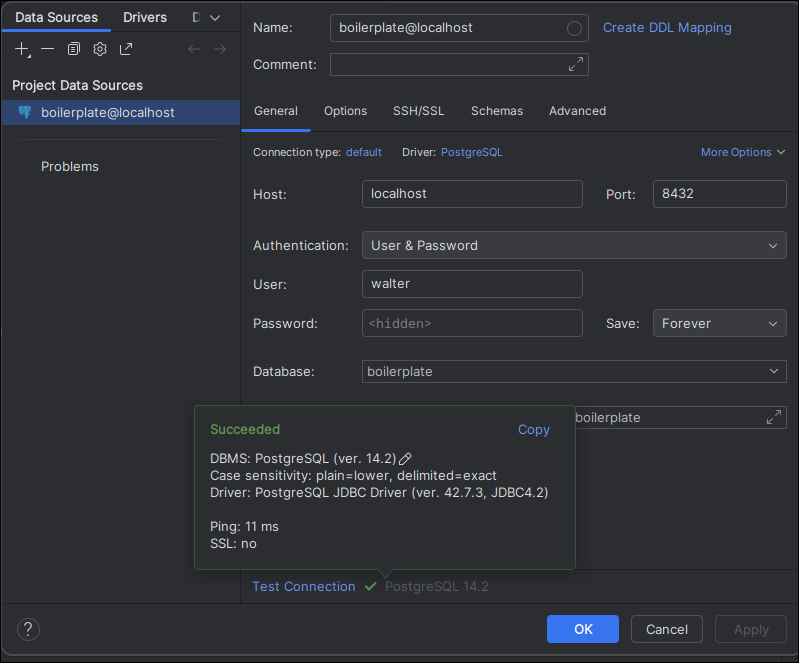

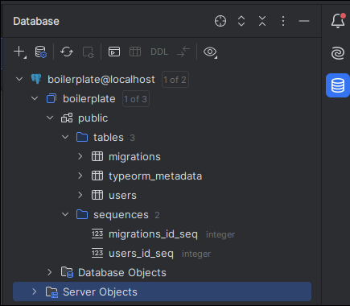

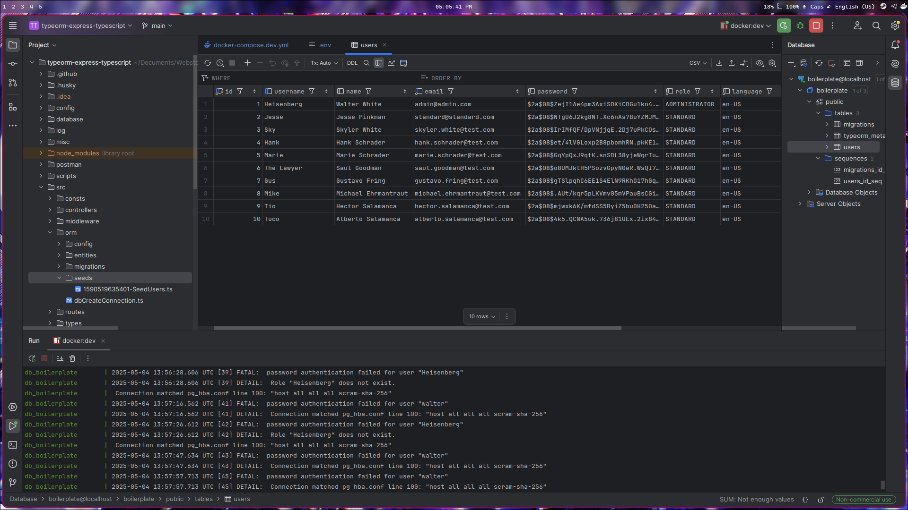

Перевіряємо у папці src/orm/seeds що дійсно ці юзери були створені.

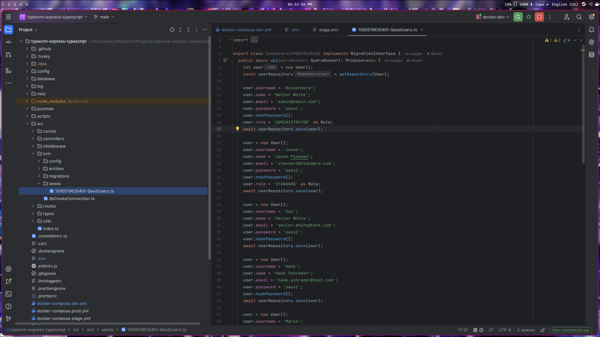

6. Перевірити запити у postman

Поперше імпортуємо запити з папці репозиторію postman до постмена

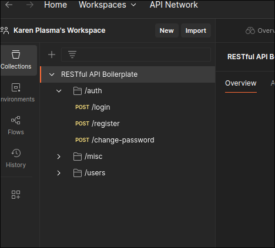

Пробуємо зробити GET запит для усіх юзерів та отримаємо помилку

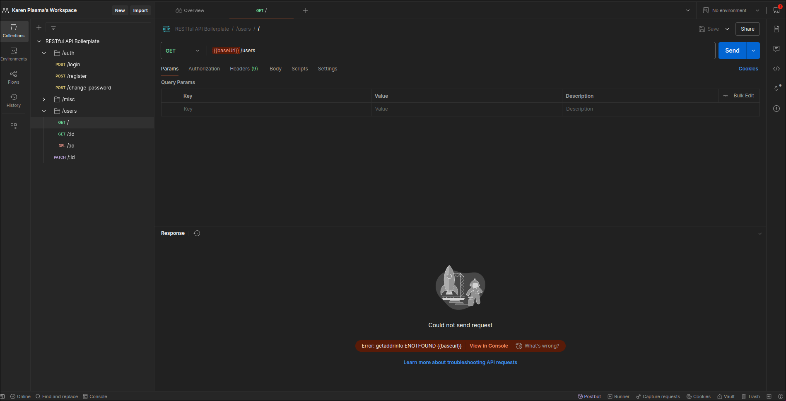

В environments ставимо set active для нашого boirelplate

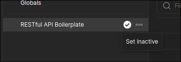

Знову отримаємо помілку, але вже 404 і дійсно, якщо дивитися в папці src/routes проекту директорія буде localhost:4000/users/v1/

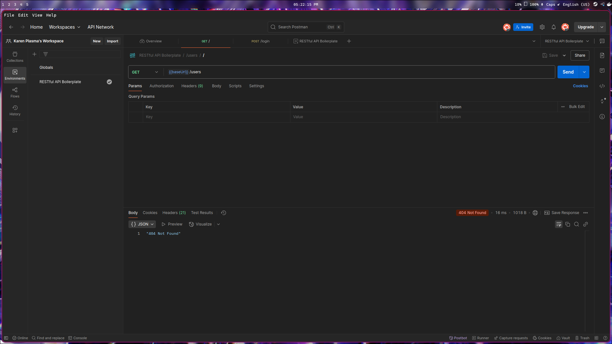

Додали в environments путь, та вже бачимо іншу помилку, але вже з авторизацією

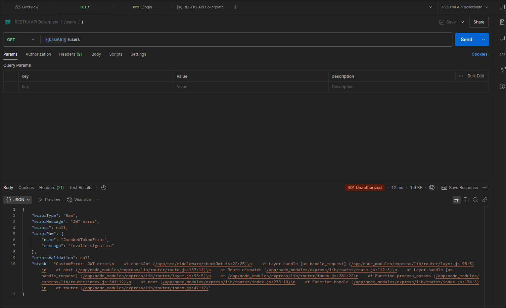

Переходимо до login та додаємо в путь /auth перед /login, перевіряємо і усе працює

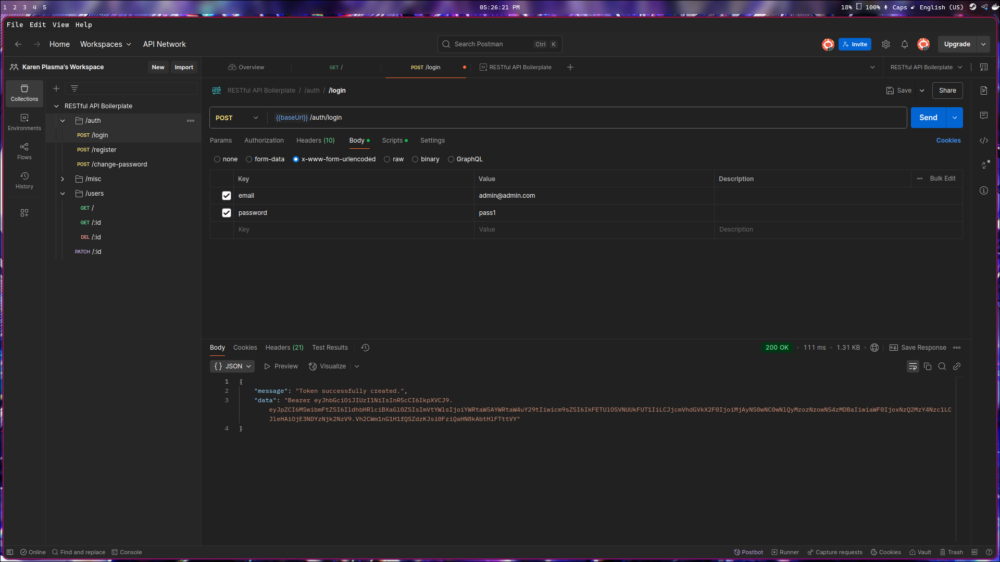

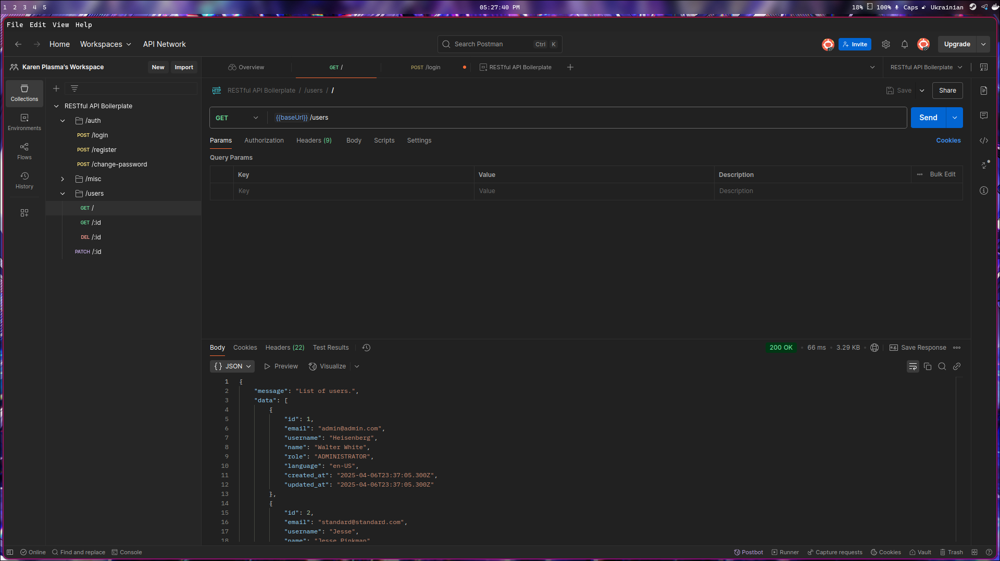

Тепер у файлі .env змінюємо порт 4000 на 4001 і 5432 на 8432

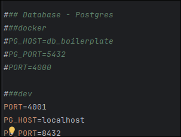

Перевіряємо і усе правцює

Висновок: В цій лабораторній роботі ми навчилися розгортати проект та налаштовувати docker контейнер та навчилися налаштовувати запити у postman.
