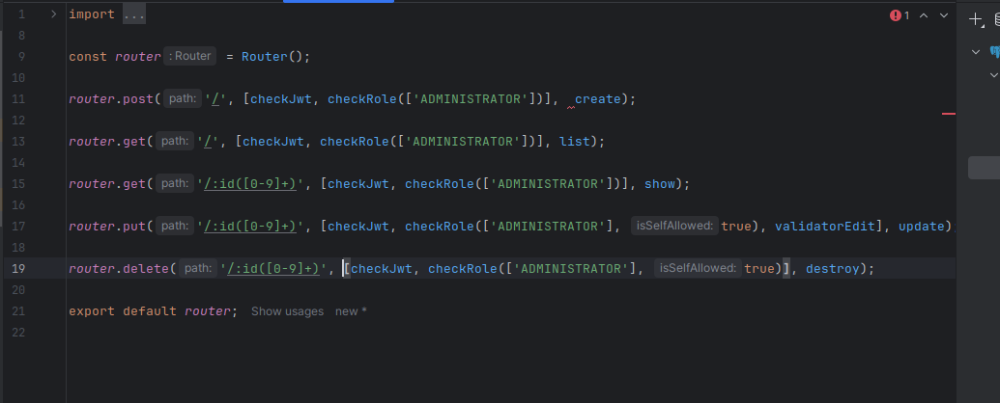

# Практично-лабораторне заняття №4
## Тема: Реалізація нової сутності, створення CRUD-операцій та відповідного RESTful API
## Мета: Закріпити навички створення повноцінної серверної логіки для роботи з новою сутністю за допомогою TypeORM, Express та TypeDI. Ознайомитися з процедурою створення міграцій, перевірки змін у структурі бази даних та тестування REST API через Postman.

### Завдання
Використовуючи boilerplate-проєкт [projectlink](https://github.com/mkosir/typeorm-express-typescript), який вже містить реалізацію сутності User та відповідного контролера, необхідно:
1. Створити нову сутність Post:
-	Визначити поля:
-	id: UUID, первинний ключ
-	title: рядок, обов’язковий
-	content: текст, необов’язковий
-	createdAt: дата створення, автоматично заповнюється
-	updatedAt: дата оновлення, автоматично оновлюється

3. Реалізувати RESTful API для CRUD-операцій:
-	Create: створення нового поста
-	Read:
-	отримання всіх постів
-	отримання одного поста за ID
-	Update: оновлення поста за ID
-	Delete: видалення поста за ID
-	Використовувати контролер, DTO, роутер та сервіс за прикладом реалізації для User.

Створив сутність Post у директорії orm/entities як "post.ts", використовуючи User.ts як приклад, створив нову сутність з необхідними полями.

Спочатку в директорії orm/controllers створив нову директорію Post, та скопіював файл list.ts з User контроллера та замінив усе необхідне для нашего контроллера Post

В контролері додав файл destroy.ts

В контролері додав файл update.ts

Додав файл у контролері index.ts

Додав у контролр show.ts

Додав у контроллер файл create.ts

Додав у routes/v1 файл posts.ts

Додав у routes/v1/index.ts маршрути на post

2. Створити та застосувати міграцію:
-	Згенерувати міграцію для нової сутності.
-	Запустити міграцію через CLI.
-	Перевірити у базі даних (наприклад, через pgAdmin або консоль), що структура таблиці відповідає очікуваній.

Запускаємо тестову міграцію за допомоги команиди `npm run migration:generate test`

Та перевіримо зміст міграції в директорії src/orm/migration

Тепер запускаємо нашу міграцію `npm run migration:run`

І дивимося в data source чи з'явився стовпчик test

Запускаємо `npm run migration:generate post`

5. Протестувати REST API через Postman:
-	Створити окрему колекцію для запитів.
-	Додати приклади:
-	створення поста,
-	отримання всіх постів,
-	отримання поста за ID,
-	оновлення поста,
-	видалення поста,
-	[опціонально] отримання постів разом із користувачем та навпаки.
-	Переконатися, що кожен ендпоінт працює відповідно до очікувань.

Запускаємо сервер та перевіряємо у postman api

Перевіряємо поперше post запит, бачимо успішне створення поста

Перевіряємо гет запит без айді

Перевіряємо гет запит з айді

Перевіряємо пут запит, бачимо що пост оновився

Запит на видалення, як бачимо також успішно спрацював

Висновок: Навчився створювати та перевіряти CRUD-операції та працювати с запитами REST API. Ознайомився зі структурою міграції, дізнався про typeorm, express, TypeDI
