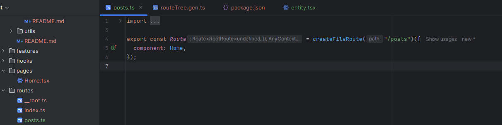
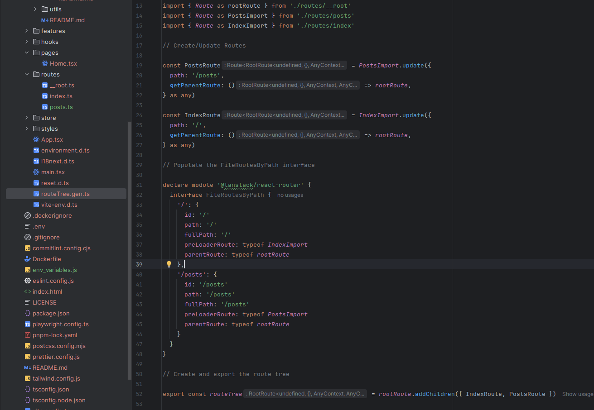

# Практично-лабораторне заняття №6
## Тема Розробка UI для реалізації CRUD-операцій
## Мета Створити користувацький інтерфейс для взаємодії з реалізованим RESTful API, що надає можливість перегляду, створення, редагування та видалення екземплярів певної сутності. Розробка ведеться на базі React з використанням TanStack Router для реалізації маршрутизації.

### Завдання
Використовуючи boilerplate-проєкт vite-react-boilerplate, для сутності Post, яка була створена в роботі “Реалізація нової сутності, створення CRUD-операцій та відповідного RESTful API”, необхідно:

1.	Сторінка колекції екземплярів сутності (/posts)
-	Реалізувати рендеринг списку всіх доступних екземплярів сутності.
-	Для кожного елемента відображати основну інформацію (ключові поля).
-	Передбачити можливість переходу на сторінку конкретного екземпляра (/posts/:id).
-	Додати кнопку "Створити новий екземпляр", яка веде на маршрут /posts/new.
-	Реалізувати можливість видалення елемента з колекції (з підтвердженням дії).

2.	Сторінка окремого екземпляра сутності (/posts/:id або /posts/new)
-	У режимі перегляду (/posts/:id) реалізувати:
-	відображення повної інформації про екземпляр;
-	можливість редагування (форма з полями);
-	кнопку для збереження змін (Update).
-	У режимі створення (/posts/new) реалізувати:
-	форму з порожніми полями для введення нових даних;
-	кнопку для збереження нового екземпляра (Create).

Спочатку перевірю чи працює проект

Усе працює, можна приступати к роботі

Спочатку в папці routes створюю posts.ts

Потім в файлі src/routeTree.gen.ts додаю дані роута posts

 

Рекомендації
-	Використовуйте useEffect та useState для завантаження та оновлення даних.
-	Для створення нових елементів рекомендується використовувати окремий маршрут (/posts/new).
-	Забезпечте просту валідацію полів (наприклад, обов’язкові поля не можуть бути порожніми).
-	Для маршрутизації використовується TanStack Router.
-	Запити до бекенду мають емулюватися через виклики мок-функцій, таких як:
-	getAllEntities()
-	getEntityById(id)
-	createEntity(data)
-	updateEntity(id, data)
-	deleteEntity(id)
-	Мок-функції мають бути винесені в окремий модуль і повертати дані у форматі, аналогічному відповіді майбутнього HTTP API.
-	У подальших заняттях ці функції будуть замінені на реальні HTTP-запити.
Вимоги до звіту
-	Результат роботи має бути оформлений у вигляді GitHub-репозиторію.
-	У репозиторії має бути створено окремий файл report.md, який містить:
-	короткий опис реалізованого функціоналу;
-	скріншоти сторінки колекції та сторінки окремого екземпляра (режими перегляду, редагування, створення);
-	коментарі щодо особливостей реалізації або проблем, з якими зіткнулися під час виконання.
