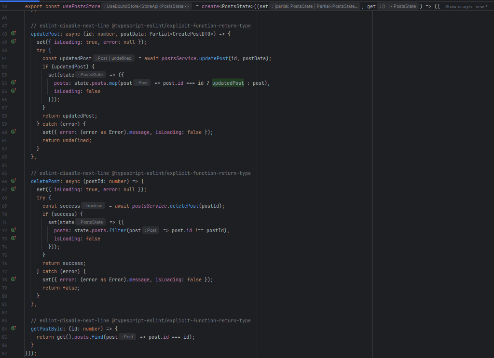
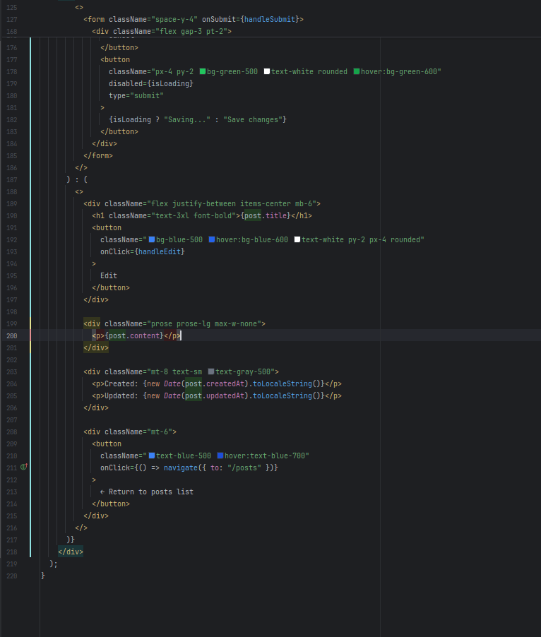

# Практично-лабораторне заняття №6
## Тема Розробка UI для реалізації CRUD-операцій
## Мета Створити користувацький інтерфейс для взаємодії з реалізованим RESTful API, що надає можливість перегляду, створення, редагування та видалення екземплярів певної сутності. Розробка ведеться на базі React з використанням TanStack Router для реалізації маршрутизації.

### Завдання
Використовуючи boilerplate-проєкт vite-react-boilerplate, для сутності Post, яка була створена в роботі “Реалізація нової сутності, створення CRUD-операцій та відповідного RESTful API”, необхідно:

1.	Сторінка колекції екземплярів сутності (/posts)
-	Реалізувати рендеринг списку всіх доступних екземплярів сутності.
-	Для кожного елемента відображати основну інформацію (ключові поля).
-	Передбачити можливість переходу на сторінку конкретного екземпляра (/posts/:id).
-	Додати кнопку "Створити новий екземпляр", яка веде на маршрут /posts/new.
-	Реалізувати можливість видалення елемента з колекції (з підтвердженням дії).

2.	Сторінка окремого екземпляра сутності (/posts/:id або /posts/new)
-	У режимі перегляду (/posts/:id) реалізувати:
-	відображення повної інформації про екземпляр;
-	можливість редагування (форма з полями);
-	кнопку для збереження змін (Update).
-	У режимі створення (/posts/new) реалізувати:
-	форму з порожніми полями для введення нових даних;
-	кнопку для збереження нового екземпляра (Create).

Спочатку перевірю чи працює проект

Усе працює, можна приступати к роботі

Реалізація кратко:
Розроблена сторінка колекції постів зі сторінкой окремого поста та функціональностю редактування та створення нового поста і усе це з використанням мок-сервіса для емуляціїї API запитів, await delay в майбутньому будуть замінені на Http запити, тому і використовуються для емуляції запитів щоб показати на екрані загрузку

types/Post.ts

Zustand-стор для управління станом постів
store/posts/index.ts

Сервіс для роботи з API з локальним сховищем та симуляції мереживих запитів
services/posts.service.ts

Маршрути поста
routes/posts/$id.ts

routes/posts/index.ts

routes/posts/new.ts

React компонент для відображеня списску постів
pages/Posts.tsx

React компонент для перегляду редагування поста
pages/PostsContent.tsx

React компонент для створення нового поста
pages/PostsNew.tsx

UI компоненти 
components/ui/Modal/index.ts

components/ui/Modal/Modal.tsx

components/ui/PostsCard/index.ts

components/ui/PostsCard/PostsCard.tsx

Результати роботи:

Висновок
Під час роботи навчився створювати інтерфейс для роботи з CRUD-операціями використовуючи Rest API та тайпскріпт у проекті vite-react-boilerplate, усі компоненти реалізовані зі стейстами завантеження і обробками помилок. Реалізована валідація обов'язкових полів форми та використання модального вікна для підтвердження видалення поста, яке забезпечує додатковий рівень безпеки для користувачів. Реалізован мок-сервіс який потім можна замінити на реальні API-запити без необхідності зміни логіки компонентів.
