# Практично-лабораторне заняття №7
## Тема Інтеграція клієнтської частини з RESTful API
## Мета Підключити користувацький інтерфейс до реального серверного API. Ознайомитися з підходами до організації HTTP-запитів через Axios, зберігання токенів доступу, обробки помилок, роботи з .env-змінними. Забезпечити повноцінну взаємодію клієнтської частини з бекендом.

## Завдання
Використовуючи реалізовану у попередньому завданні клієнтську частину (інтерфейс для роботи з сутністю Post), внести такі зміни:
1. Налаштування змінних оточення:
-	У корені проєкту створити файл .env
-	Додати до нього такі змінні:
VITE_API_BASE_URL=http://localhost:4000/v1
VITE_API_AUTH_TOKEN=your_jwt_token_here

-	Реалізувати використання цих змінних у конфігурації Axios

2. Створити конфігурацію Axios:
-	Створити окремий файл (наприклад, src/api/axios.ts)
-	Налаштувати базовий baseURL, заголовок Content-Type, токен авторизації:

axios.defaults.baseURL = import.meta.env.VITE_API_BASE_URL;

axios.defaults.headers.common['Authorization'] = `Bearer
${import.meta.env.VITE_API_AUTH_TOKEN}`;

-	Реалізувати обробку помилок через інтерцептор (наприклад, логування у консоль або показ повідомлення)

3. Замінити мок-функції на реальні HTTP-запити:
У файлі з API-функціями (src/api/posts.ts або аналогічному) замінити реалізацію:
-	getAllEntities() → GET /posts
-	getEntityById(id) → GET /posts/:id
-	createEntity(data) → POST /posts
-	updateEntity(id, data) → PUT /posts/:id
-	deleteEntity(id) → DELETE /posts/:id

Після створення файлу env використовую порт с backend проекту typeorm-express-typescript 4001, та з папки postman файлу environments того ж проекту беру beaver токен. 

З цього моменту в документі 
typeorm-express-typescript - backend
vite-react-boilerplate - frontend

frontend
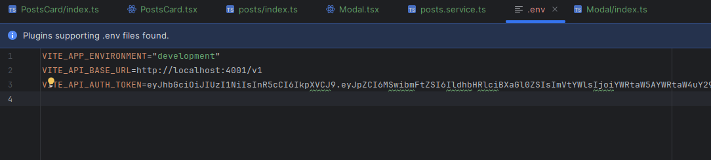

backend
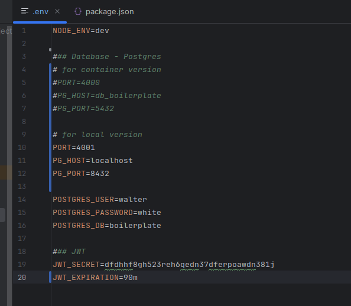

Створив конфігурацію axios у src/api/axios.ts та налаштував ьазовий baseURL, с заголовком COntent-Type
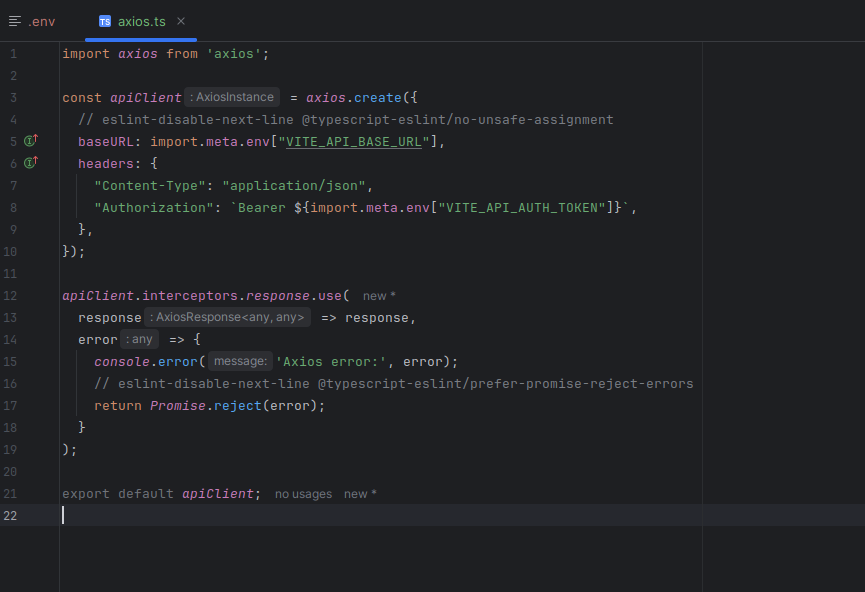

Замінив усі мок-функції на запити axios
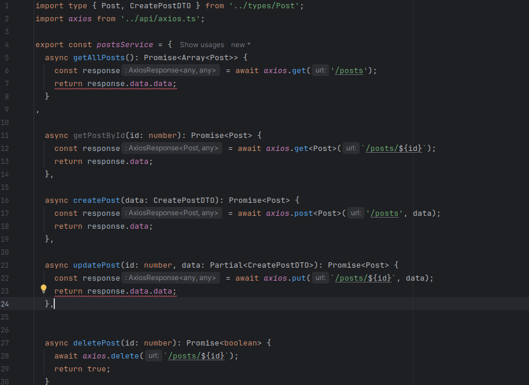

## Перевірка роботи
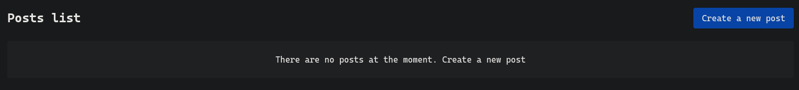

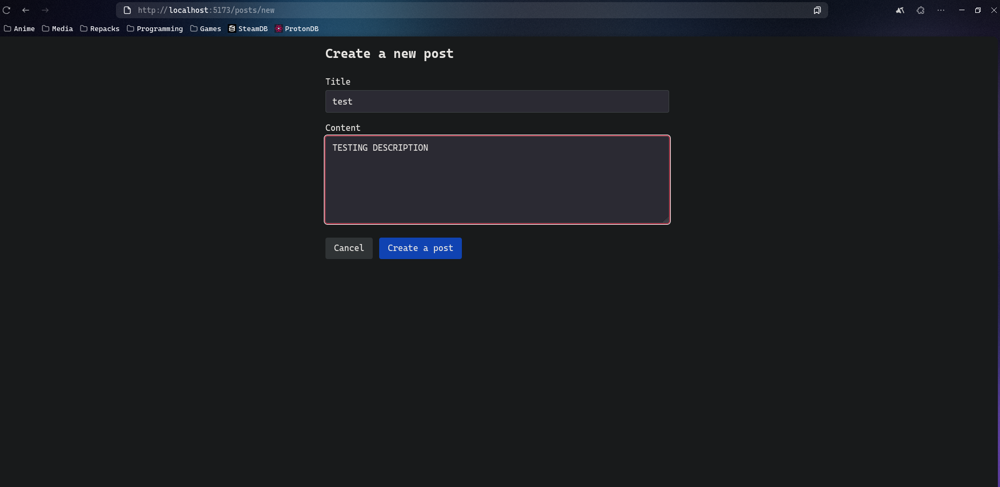

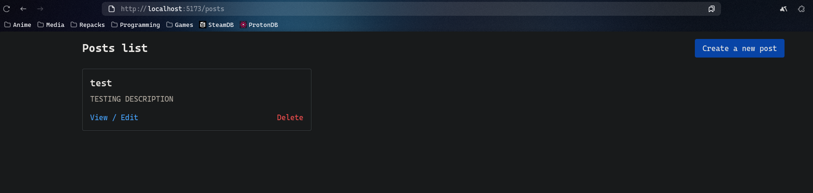

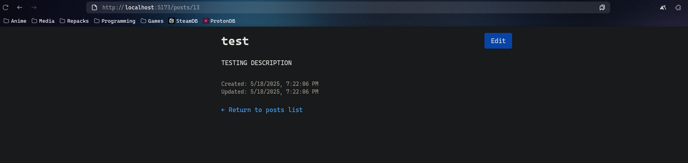

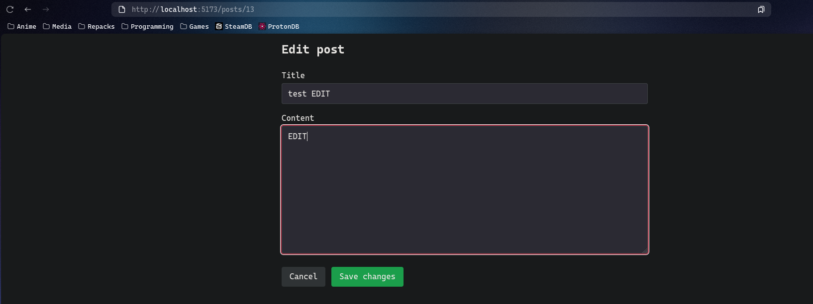

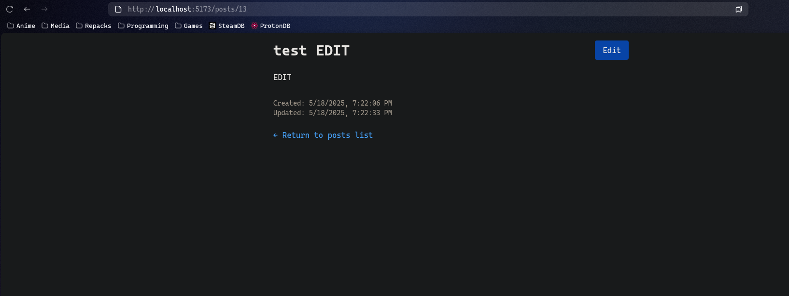

Усе працює як потрібно

Робимо CRUD запити через DevTools -> Network

GET
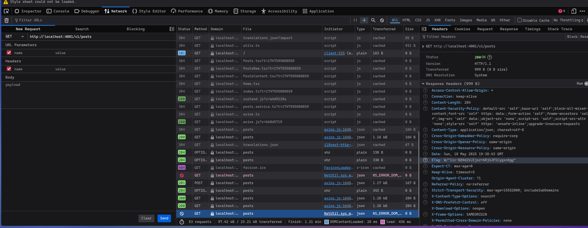

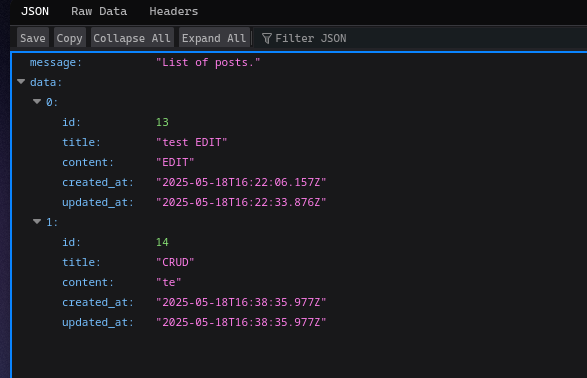

GET Поста 13
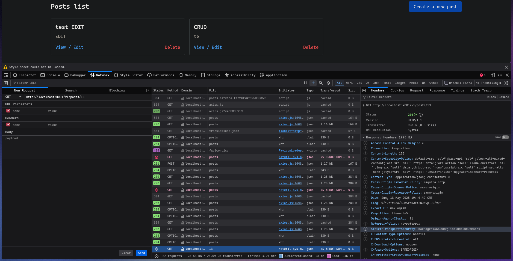

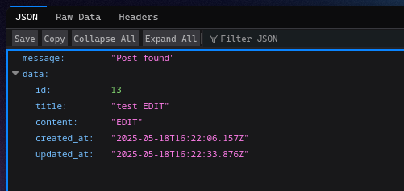

POST запит
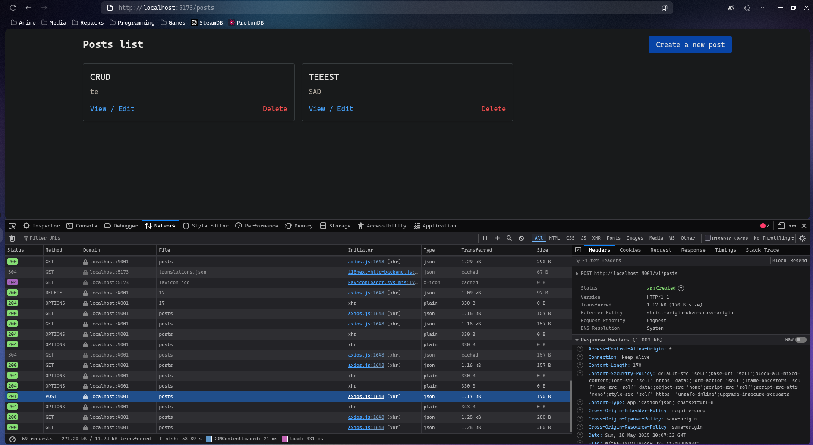

PUT
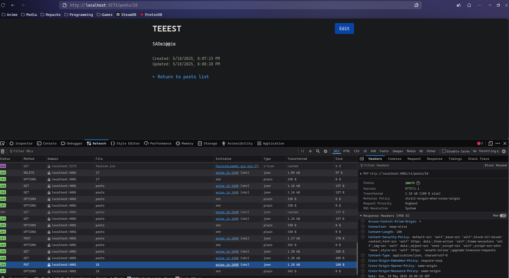

DELETE пост 16

Та приклад апдейту використовуя api
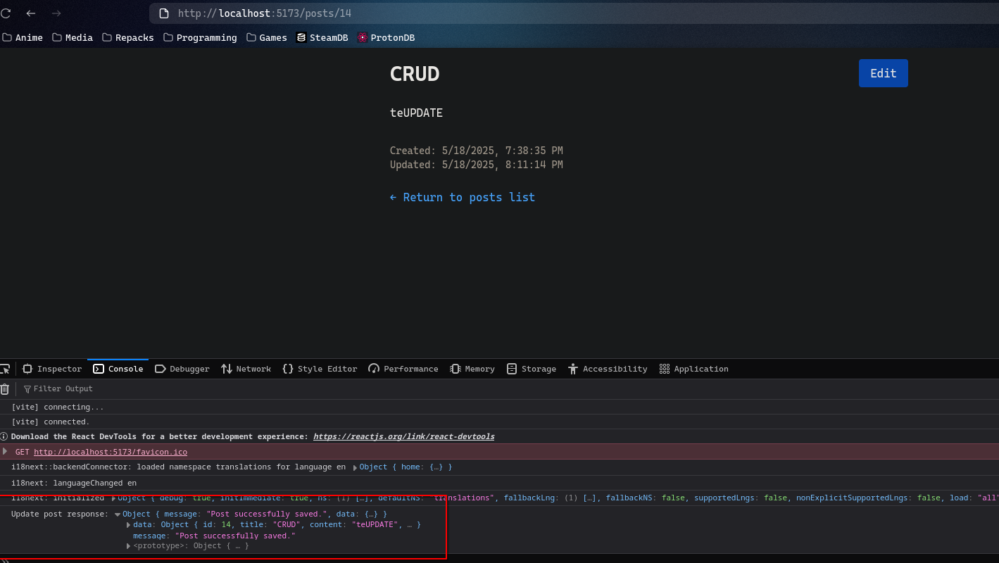

Висновок:
У процесі виконання завдання було успішно реалізовано повноцінну роботу з постами (CRUD) у веб-додатку на React і Node.js. Вирішено ключові проблеми узгодження даних між фронтендом і бекендом (назви полів, формат відповіді API), виправлено помилки оновлення постів, налаштовано Axios і Zustand для коректної роботи з API та управління станом. Робота покращила навички роботи з REST API, TypeScript, асинхронними операціями й дебагінгом. Отриманий досвід стане у пригоді для подальшої розробки надійних веб-застосунків із правильною взаємодією фронтенду й бекенду.
