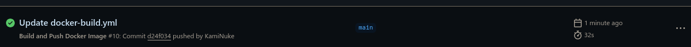
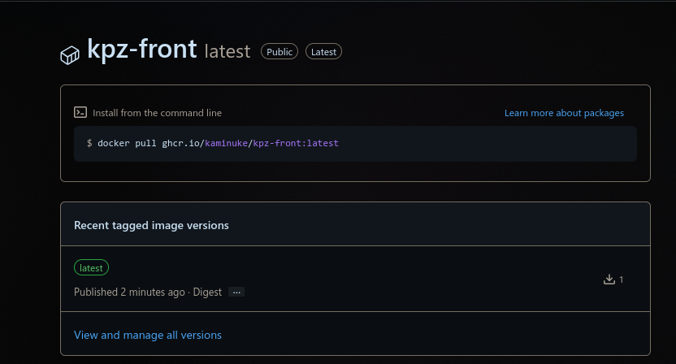

# Практично-лабораторне заняття №8
## Тема Неперервна интеграція
## Мета Ознайомитися з принципами і практиками неперервної інтеграції, сформувати навички автоматизації CI/CD процесів в GitHub Actions

### Завдання

1. Пройти цей гайд [Hello GitHub Actions](https://github.com/skills/hello-github-actions?tab=readme-ov-file)

[Посилання на мою копію репозиторія](https://github.com/KamiNuke/skills-hello-github-actions)

Нажав на кнопку почати курс та перенес себе на сторінку створення форку репозитоія


Створив новий pull request по гайду з README.md


Створив новий файл welcome.yml
```
name: Post welcome comment
on:
  pull_request:
    types: [opened]
permissions:
  pull-requests: write
```

Оновив цей файл
```
name: Post welcome comment
on:
  pull_request:
    types: [opened]
permissions:
  pull-requests: write
jobs:
  build:
    name: Post welcome comment
    runs-on: ubuntu-latest
```

Оновив знову файл на
```
name: Post welcome comment
on:
  pull_request:
    types: [opened]
permissions:
  pull-requests: write
jobs:
  build:
    name: Post welcome comment
    runs-on: ubuntu-latest
    steps:
      - run: gh pr comment $PR_URL --body "Welcome to the repository!"
        env:
          GITHUB_TOKEN: ${{ secrets.GITHUB_TOKEN }}
          PR_URL: ${{ github.event.pull_request.html_url }}
```

Зробив merge request pull request який створили на початку до main бранча

Створив новий бранч test-workflow

Додав зміни до README.md

Створив pull request та merge into main бранч

Гайд закінчився

[Посилання на мою копію репозиторія](https://github.com/KamiNuke/skills-hello-github-actions)

2. [Publish Package](https://github.com/skills/publish-packages)

[Посилання на мій форк Publish Package](https://github.com/KamiNuke/skills-publish-packages)

Нажав на кнопку почати курс та створив копію репозиторію

Змінити бранч на cd

Створив новий файл в .github/workflows під назвою publish.yml з наступним вмістом:
```
name: Publish to Docker
on:
  push:
    branches:
      - main
permissions:
  packages: write
  contents: read
jobs:
  publish:
    runs-on: ubuntu-latest
    steps:
      - name: Checkout
        uses: actions/checkout@v4
      # Add your test steps here if needed...
      - name: Docker meta
        id: meta
        uses: docker/metadata-action@v5
        with:
          images: ghcr.io/KamiNuke/publish-packages/game
          tags: type=sha
      - name: Login to GHCR
        uses: docker/login-action@v3
        with:
          registry: ghcr.io
          username: ${{ github.repository_owner }}
          password: ${{ secrets.GITHUB_TOKEN }}
      - name: Build container
        uses: docker/build-push-action@v5
        with:
          context: .
          push: true
          tags: ${{ steps.meta.outputs.tags }}
```

Зробив pull request та створив новий файл Dockerfile з вмістом:
```
FROM nginx:1.24-alpine
COPY . /usr/share/nginx/html
```

Зробив merge request та видалив cd branch

створив новий токен(класичний) з необхідними правами на 7 днів


Аунтефіцировав пакет


Встановив docker image з репозиторія


Запустив docker image через термінал docker run -dp 8080:80 --rm image_id

Гайд закінчився на цьому місті...

2. Створити власний GitHub Workflow для збірки докер-образу front-end
репозиторію та завантаження його у GitHub container registry

Створив репозиторій фронтенду [frontend](https://github.com/KamiNuke/kpz-front) та запушив зміни


2.1. Створити воркфлоу з двома тригерами
* тригер за ручним вкиликом
* тригер за пушем коміту в наступні гілки:
    - main
    - feature/*

2.2. Воркфлоу має містити 1 job з наступними кроками всередині:
* Клонування репозиторію з налаштуваннями за замовчуванням(див.
actions/checkout)
* Встановлення pnpm за допомогою npm install, встановлення залежностей за
допомогою pnpm install, та збірку проєкту за допомогою pnpm run build.
    * Зазначені команди цього пункту мають бути виконані в одному скрипті
* Авторизацію в GitHub Container Registry(див docker/login-action)
    * вказати ghcr.io. в полі registry
    * вказати власне ім‘я користувача в полі username(
        * додатково: використайте значення з github context
    * вказати вбудований GITHUB_TOKEN в якості паролю
* Збірку та завантаження Докер-образу в GitHub container registry(див
docker/build-push-action)
    * Вказати поточну директорію в полі context
    * Встановити в полі push значення true
    * Встановити tag наступного вигляду: ghcr.io/{{ваш_логін}}/{{ім‘я_репозиторію}}
        * Логін та ім‘я репозиторію отримати з github context

Worflow з одного job який 
1. клонує репозиторій
2. Встановлює pnpm та залежності зі збіркою проекта і усе це один скрипт
3. Авторизується до GitHub Containter Registry через docker/login-action@v3
4. Збирає та публікує docker-image через docker/build-push-action@v5

```
name: Build and Push Docker Image

on:
  push:
    branches:
      - main
      - 'feature/*'
  workflow_dispatch:

permissions:
    contents: read
    packages: write
    attestations: write
    id-token: write

jobs:
  build-and-push:
    runs-on: ubuntu-latest

    steps:
        #1
      - name: Checkout repository
        uses: actions/checkout@v4
        #2
      - name: Install pnpm and build project
        run: |
          npm install -g pnpm
          pnpm install
          pnpm run build
        #3
      - name: Login to GitHub Container Registry
        uses: docker/login-action@v3
        with:
          registry: ghcr.io
          username: ${{ github.actor }}
          password: ${{ secrets.GITHUB_TOKEN }}
        #4
      - name: Build and push Docker image
        uses: docker/build-push-action@v5
        with:
          context: .
          push: true
          tags: ghcr.io/kaminuke/kpz-front
```

Після додавання перевіряю щоб acctions був успішним



2.3. Перейти в свій акаунт GitHub на вкладку Packages та пересвідчитися що там
відображено Ваш Докер-образ

Перевіряю що в packages з'явився docker-image



Висновок:
В ціїй роботі навчився створювати власний github workflow для збірки docker-image та ознайомився з принципами і практиками неперервної інтеграції, сформував навички автоматизації CI/CD процесів в GitHub Actions
