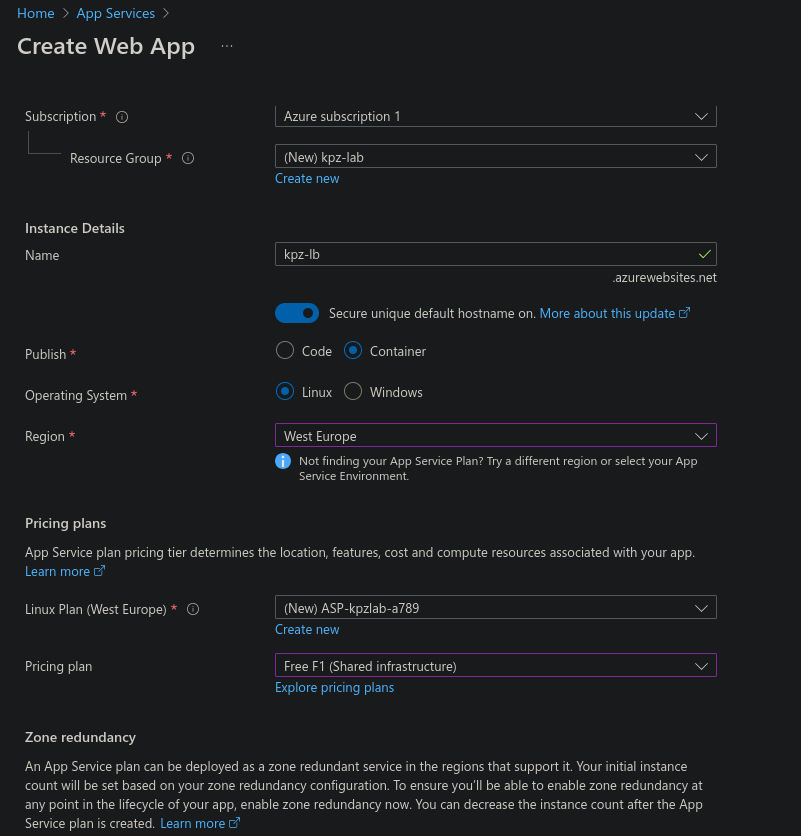

# Практично-лабораторне заняття №9
## Тема: Неперервна доставка
## Мета: ознайомитися з принципами і практиками неперервної доставки, сформувати навички роботи з хмарними сервісами Azure

### Завдання:
1. Створити Azure App Service у власній підписці Azure:
a. Створити ресурсну групу (resource group)
b. Створити всередині ресурсної групи App Servicе. При створенні вибрати деплой контейнеру замість коду

2. Створити у Azure Service principal, який буде використовуватись для доступу GitHub до вашої підписки Azure:
a. в порталі Azure праворуч від рядка пошуку натисніть на значок з зображенням командного рядка
b. оберіть bash
c. при виборі App Service Plan оберіть план Free
d. виконайте наступну команду, замінивши subscription_id на ідентифікатор підписки, а resource_group_name на назву створеної вами ресурсної групи:
```
az ad sp create-for-rbac --name "myApp" --role contributor --scopes /subscriptions/<subscription_id>/resourceGroups/<resource_group_name> --json-auth

```
e. Ідентифікатор підписки можна знайти, ввівши в рядок пошуку subscriptions, перейшовши в список підписок і знайшовши там свою(скоріше за все вона буде єдиною), після того як ви клацнете на неї в загальній інформації скопіюйте subscription_id
f. Після того як команду будет виконано, скопіюйте весь консольний вивід, що матиме таку структуру:
```
{
    "clientId": "<GUID>",
    "clientSecret": "<GUID>",
    "subscriptionId": "<GUID>",
    "tenantId": "<GUID>",
    (...)
    }
```

3. Поверніться до вашого github-репозиторію. Перейдіть в settings -> secrets and variables -> actions, та натисніть New Repository Secret. В полі Name введіть AZURE_CREDENTIALS а в поле Secret скопіюйте повністю вивід команди з пункту 2е. Слідкуйте за тим щоб в кінці секрету на було пробілу або переходу рядка, натисніть Add Secret
4. Додати нову job в ваш github workflow, створений на попередньому занятті. В неї додати наступні степи:
a. Логін в Azure з посиланням на секрет в якому зберігаються дані для доступу
```
    - uses: azure/login@v2
    with:
    creds: ${{ secrets.AZURE_CREDENTIALS }}
```
b.Деплой в Azure App Service. Замініть <app_service_name> на назву створеного вами app service
```
    - name: Deploy to Azure Web App
    uses: azure/webapps-deploy@v2
    with:
        app-name: <app_service_name>
        images: ghcr.io/${{ github.repository_owner }}/${{ github.event.repository.name }}:latest
```
5. Запустіть воркфлоу та пересвідчиться що він завершився успішно.
6. В логах степу Deploy to Azure Web App знайдіть рядок який починається з App Service Application Url та клікніть по посиланню. Ви маєте побачити веб сторінку з Вашим фронт-ендом. Якщо сторінку не видно – почекайте кілька хвилин та поверніться

Створив безкоштовний azure app



Обираю bash при вибору shell-а


Створив principal та отримав credentials


Додав AZURE CREDENTIAL до репозиторія


Додав jobs для деплоя azure

```
  deploy-to-azure:
    needs: build-and-push
    runs-on: ubuntu-latest

    steps:
      - name: Login to Azure
        uses: azure/login@v2
        with:
          creds: ${{ secrets.AZURE_CREDENTIALS }}

      - name: Deploy to Azure Web App
        uses: azure/webapps-deploy@v2
        with:
          app-name: kpz-lb  
          images: ghcr.io/kaminuke/kpz-front:latest
```

Перевіряємо щоб jobs були успішні


Переходжу по посиланню яке з'явилося в github actions, і бачимо, що сайт працює успішно


Висновок:
Під час виконання практично-лабораторного заняття було опановано основні принципи та інструменти неперервної доставки (Continuous Delivery) із використанням хмарної платформи Azure. Було створено ресурсну групу та Azure App Service для розгортання контейнерного додатку. За допомогою Azure CLI створено service principal, що забезпечує безпечний доступ GitHub Actions до підписки Azure.

У GitHub репозиторії налаштовано секрет для зберігання облікових даних Azure, а також додано новий job у workflow, який виконує автентифікацію в Azure та деплой додатку в App Service після успішного збірки Docker-образу.

